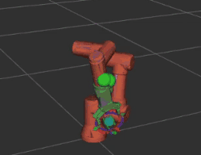
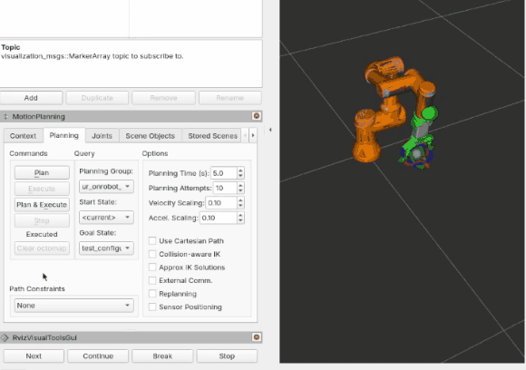
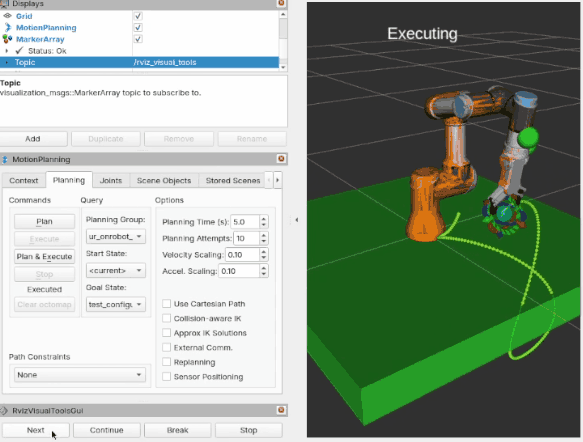
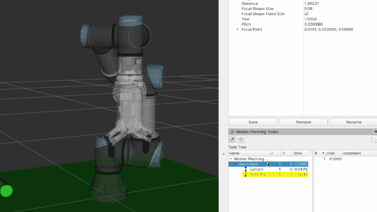
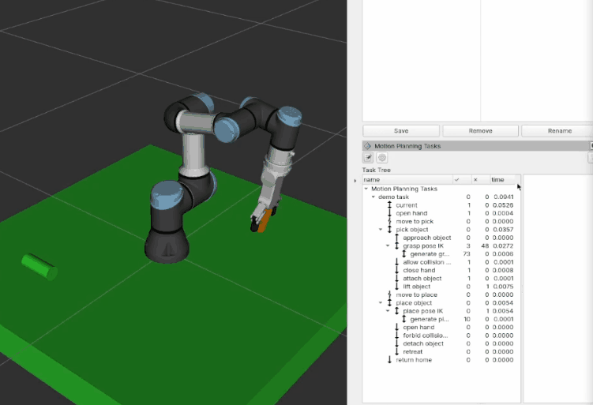

# moveit2_tutorials_ur_onrobot

This repo accompanies the YouTube video below. Watch the video here:

[](https://www.youtube.com/watch?v=MxNHT5QaHlg)

Following the MoveIt 2 tutorial examples, but with a [UR manipulator + OnRobot gripper] robot instead of the Panda.

Before using this repo, make sure to have the [UR_OnRobot_ROS2](https://github.com/tonydle/UR_OnRobot_ROS2) package set up and working. If you have not already set that up, go there first and follow its installation instructions.

This repo contains two ROS 2 packages:

- `ur_onrobot_hello_moveit`
- `ur_onrobot_mtc`

## Setup

Clone this repo into your workspace, then install any missing ROS dependencies:

```bash
rosdep install --from-paths src --ignore-src -r -y
```

Build and source the workspace:

```bash
colcon build --packages-select ur_onrobot_hello_moveit ur_onrobot_mtc
source install/setup.bash
```

## Run the demos

1. Start the driver with the UR3e + RG2 robot and fake hardware, but keep its RViz off:

```bash
ros2 launch ur_onrobot_control start_robot.launch.py ur_type:=ur3e onrobot_type:=rg2 use_fake_hardware:=true launch_rviz:=false
```

2. Start the MoveIt config for the same configuration, also with RViz off:

```bash
ros2 launch ur_onrobot_moveit_config ur_onrobot_moveit.launch.py ur_type:=ur3e onrobot_type:=rg2 launch_rviz:=false
```

3. Start one shared RViz session with the custom config from this repo:

```bash
ros2 launch ur_onrobot_hello_moveit tutorials_rviz.launch.py
```

4. Keep those three terminals running, then run the demos below one at a time in a fourth terminal.

## Demo 1: Your First Project

```bash
ros2 run ur_onrobot_hello_moveit your_first_project
```



## Demo 2: Visualizing In RViz

```bash
ros2 run ur_onrobot_hello_moveit visualizing_in_rviz
```



## Demo 3: Planning Around Objects

```bash
ros2 run ur_onrobot_hello_moveit planning_around_objects
```



## Demo 4: Minimal MTC

```bash
ros2 run ur_onrobot_mtc minimal
```



## Demo 5: Pick And Place MTC

```bash
ros2 launch ur_onrobot_mtc pick_and_place_demo.launch.py
```


